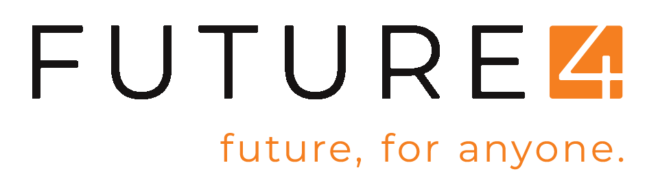

<h1 align="center">
    
     
    Projetos do bootcamp
</h1>

<h4 align="center">
  Projetos desenvolvidos durate o bootcamp.
</h4>

  

  

  

  

  

  

## :rocket: Tecnologias

- Flexbox
- CSS Grid
- Vanilla Javascript
- React
- VsCode

## :pushpin: Projetos

- Loja
- Portfolio
- FutureTube(https://lfvirtuoso.github.io/futureTube/)
- Blackjack

---

Feito com ♥ por Filipe Virtuoso. [Entre em contato](https://www.linkedin.com/in/lfvirtuoso/)
